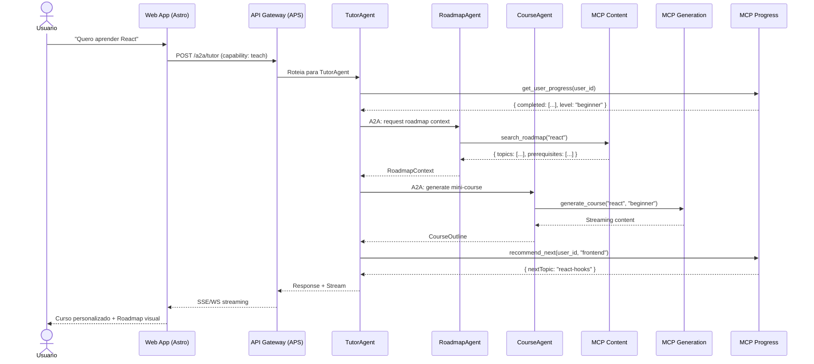

# Plano de Transformação Arquitetural: roadmap.sh → Ecossistema de Agentes (A2A / APS / ACP / MCP)

> **Data:** 2026-07-30  
> **Projeto Base:** [developer-roadmap](https://github.com/kamranahmedse/developer-roadmap) (Astro 5 + React 19 + TailwindCSS 4)  
> **Objetivo:** Evoluir a plataforma de roadmaps estáticos/interativos para um ecossistema de agentes autônomos, interoperáveis e extensíveis, utilizando os protocolos emergentes de comunicação entre agentes e MCP (Model Context Protocol).

---

## 1. Diagnóstico da Arquitetura Atual

### 1.1 Stack Tecnológico

| Camada       | Tecnologia                                          | Função                                            |
| ------------ | --------------------------------------------------- | ------------------------------------------------- |
| **Frontend** | Astro 5 (SSR) + React 19 + TailwindCSS 4            | Renderização de páginas, componentes interativos  |
| **Backend**  | Astro SSR (`output: 'server'`) + Node.js standalone | APIs server-side, autenticação, streaming         |
| **Dados**    | Arquivos JSON + Markdown (i18n)                     | Roadmaps, guias, best-practices, questionários    |
| **Scripts**  | Node.js / TypeScript (CLI)                          | Geração de conteúdo, manutenção, tradução         |
| **IA**       | OpenAI / Google Gemini (via `ai` SDK)               | Geração de cursos, roadmaps personalizados, tutor |
| **Storage**  | Local FS + `localStorage` (cliente)                 | Assets estáticos, estado de progresso do usuário  |

### 1.2 Domínios Funcionais Atuais

```
┌─────────────────────────────────────────────────────────────┐
│                    ROADMAP.SH (Monolito)                     │
├──────────────┬──────────────┬──────────────┬────────────────┤
│   Conteúdo   │   Interativo │   Social     │      IA        │
├──────────────┼──────────────┼──────────────┼────────────────┤
│ • Roadmaps   │ • Editor     │ • Accounts   │ • AI Tutor     │
│ • Guides     │ • Renderer   │ • Friends    │ • GenCourse    │
│ • Best-Prac  │ • Progress   │ • Leaderboard│ • GenRoadmap   │
│ • Questions  │ • Roadcards  │ • Dashboard  │ • AI Roadmaps  │
│ • Projects   │ • FAQs       │ • Billing    │ • Streaming    │
└──────────────┴──────────────┴──────────────┴────────────────┘
```

### 1.3 Pontos de Atrito Identificados

1. **Acoplamento de conteúdo e apresentação:** Roadmaps JSON estão ligados à renderização visual (nodes/edges com coordenadas absolutas).
2. **IA "colada":** A geração de conteúdo por IA é um fluxo ponta-a-ponta monolítico, sem reuso de capabilities.
3. **Escalabilidade de conteúdo:** Scripts CLI são executados manualmente; não há orquestração automática.
4. **Falta de interoperabilidade:** O conteúdo educacional não é exposto como capabilities reusáveis por outros agentes.
5. **Estado fragmentado:** Progresso do usuário, roadmaps customizados e cursos IA vivem em silos.

---

## 2. Visão da Arquitetura Alvo

### 2.1 Conceitos Fundamentais

| Conceito       | Definição                                                                                                        | Mapeação no Projeto                                                     |
| -------------- | ---------------------------------------------------------------------------------------------------------------- | ----------------------------------------------------------------------- |
| **Capability** | Uma função de negócio de alto nível que um agente pode executar (ex: "Ensinar Frontend", "Avaliar Conhecimento") | Roadmaps, Cursos, Avaliações, Geração de Conteúdo                       |
| **Skill**      | Implementação técnica e especializada de uma capability (ex: "Explicar React Hooks", "Gerar Quiz de Node.js")    | Conteúdo markdown de tópicos, geradores de questões, parsers de roadmap |
| **Tool**       | Função executável que um agente pode invocar (ex: buscar dados, renderizar gráfico, chamar API externa)          | Scripts de geração, renderers, APIs de tradução, validadores de link    |
| **Agent**      | Entidade autônoma que orquestra skills e tools para cumprir uma capability                                       | TutorAgent, RoadmapAgent, CourseAgent, ContentAgent                     |
| **MCP Server** | Servidor que expõe tools e resources via Model Context Protocol para LLMs                                        | Servidor de conteúdo, servidor de progresso, servidor de geração        |

### 2.2 Protocolos de Comunicação

| Protocolo                              | Escopo                          | Função na Nova Arquitetura                                                                                                                            |
| -------------------------------------- | ------------------------------- | ----------------------------------------------------------------------------------------------------------------------------------------------------- |
| **MCP (Model Context Protocol)**       | Agente ↔ Ferramenta / Recurso   | Padroniza como LLMs acessam tools, recursos e prompts externos. Torna o conteúdo do roadmap.sh disponível como contexto para qualquer LLM compatível. |
| **A2A (Agent-to-Agent)**               | Agente ↔ Agente                 | Permite que o TutorAgent converse com o RoadmapAgent para personalizar um plano de estudos, ou que um agente externo consulte o ContentAgent.         |
| **APS (Agent Protocol Standard)**      | Agente ↔ Orquestrador / Gateway | Define descoberta, health-check, autenticação e metadados de agentes. Usado no registry de agentes da plataforma.                                     |
| **ACP (Agent Communication Protocol)** | Mensageria entre agentes        | Protocolo de mensagens (task/request/response/stream) para comunicação assíncrona entre agentes distribuídos.                                         |

### 2.3 Arquitetura de Referência

```
┌─────────────────────────────────────────────────────────────────────────────┐
│                           CAMADA DE CONSUMO                                  │
├─────────────────────────────────────────────────────────────────────────────┤
│  🌐 Web App (Astro/React)  │  🤖 Chatbots  │  🔌 MCP Clients (Claude, etc)  │
└─────────────────────────────────────────────────────────────────────────────┘
                                      │
                              ┌───────▼────────┐
                              │  API Gateway   │  ← APS: descoberta, auth, rate-limit
                              │   (A2A Hub)    │
                              └───────┬────────┘
                                      │
┌─────────────────────────────────────┼───────────────────────────────────────┐
│                         CAMADA DE AGENTES (A2A / ACP)                        │
│  ┌─────────────┐  ┌─────────────┐  ┌─────────────┐  ┌─────────────────────┐  │
│  │ TutorAgent  │◄─┤ RoadmapAgent│◄─┤ CourseAgent │◄─┤   ContentAgent      │  │
│  │  (ensinar)  │  │  (navegar)  │  │  (gerar)    │  │  (criar/editar)     │  │
│  └──────┬──────┘  └──────┬──────┘  └──────┬──────┘  └──────────┬──────────┘  │
│         │                │                │                    │             │
│  ┌──────▼──────┐  ┌──────▼──────┐  ┌──────▼──────┐  ┌──────────▼──────────┐  │
│  │ Assessment  │  │ ProgressAgent│  │  UserAgent  │  │ TranslationAgent    │  │
│  │   Agent     │  │  (tracking)  │  │ (perfil)    │  │  (i18n)             │  │
│  └─────────────┘  └─────────────┘  └─────────────┘  └─────────────────────┘  │
└─────────────────────────────────────────────────────────────────────────────┘
                                      │
┌─────────────────────────────────────┼───────────────────────────────────────┐
│                      CAMADA DE MCP SERVERS (Tools & Resources)               │
│                                                                              │
│  ┌─────────────────────────────────────────────────────────────────────┐    │
│  │                    MCP Content Server                                │    │
│  │  • tools: search_roadmap, get_topic, list_roadmaps, validate_links  │    │
│  │  • resources: roadmap://{id}, topic://{slug}, guide://{slug}        │    │
│  └─────────────────────────────────────────────────────────────────────┘    │
│  ┌─────────────────────────────────────────────────────────────────────┐    │
│  │                    MCP Progress Server                               │    │
│  │  • tools: track_progress, get_streak, recommend_next                │    │
│  │  • resources: user://{id}/progress, user://{id}/streak              │    │
│  └─────────────────────────────────────────────────────────────────────┘    │
│  ┌─────────────────────────────────────────────────────────────────────┐    │
│  │                    MCP Generation Server                             │    │
│  │  • tools: generate_course, generate_roadmap, generate_questions     │    │
│  │  • prompts: course-prompt, roadmap-prompt                           │    │
│  └─────────────────────────────────────────────────────────────────────┘    │
│  ┌─────────────────────────────────────────────────────────────────────┐    │
│  │                    MCP Community Server                              │    │
│  │  • tools: submit_content, review_content, vote_topic                │    │
│  │  • resources: contribution://{id}, review://{id}                    │    │
│  └─────────────────────────────────────────────────────────────────────┘    │
└─────────────────────────────────────────────────────────────────────────────┘
                                      │
┌─────────────────────────────────────┼───────────────────────────────────────┐
│                         CAMADA DE DADOS (Skills & Stores)                    │
│                                                                              │
│  ┌─────────────┐  ┌─────────────┐  ┌─────────────┐  ┌─────────────────────┐  │
│  │  SkillStore │  │ ContentStore│  │  VectorDB   │  │   Event Bus         │  │
│  │  (skills    │  │  (JSON/Mark)│  │  (embeddings│  │   (ACP messages)    │  │
│  │   registry) │  │             │  │   de tópicos)│  │                     │  │
│  └─────────────┘  └─────────────┘  └─────────────┘  └─────────────────────┘  │
└─────────────────────────────────────────────────────────────────────────────┘
```

---

## 3. Mapeamento: Funcionalidades Atuais → Nova Arquitetura

### 3.1 Tabela de Transformação

| Funcionalidade Atual   | Componentes                                              | Nova Entidade                                            | Protocolo            |
| ---------------------- | -------------------------------------------------------- | -------------------------------------------------------- | -------------------- |
| Roadmaps interativos   | `src/data/roadmaps/`, `roadmap-renderer`                 | **RoadmapAgent** + MCP Content Server                    | MCP (resources), A2A |
| Guias e artigos        | `src/data/guides/`, `src/components/Guide/`              | **ContentAgent** + MCP Content Server                    | MCP (resources)      |
| Best Practices         | `src/data/best-practices/`                               | **ContentAgent** + skill `best-practice-expert`          | MCP                  |
| Questionários          | `src/data/question-groups/`                              | **AssessmentAgent** + MCP Quiz Server                    | MCP (tools), A2A     |
| Geração de Cursos IA   | `src/components/GenerateCourse/`, `src/lib/ai.ts`        | **CourseAgent** + MCP Generation Server                  | MCP (tools/prompts)  |
| Geração de Roadmaps IA | `src/components/GenerateRoadmap/`                        | **RoadmapAgent** + MCP Generation Server                 | MCP, A2A             |
| AI Tutor               | `src/components/AITutor/`                                | **TutorAgent** (orquestra Roadmap + Course + Assessment) | A2A, ACP             |
| Progresso do usuário   | `localStorage`, `resource-progress.ts`                   | **ProgressAgent** + MCP Progress Server                  | MCP (resources)      |
| Traduções (i18n)       | `scripts/translate-json.ts`, `.pt-br.md`                 | **TranslationAgent** + skill `translator`                | A2A (offload)        |
| Scripts de manutenção  | `scripts/roadmap-content.cjs`, `compress-images.ts`      | **ContentAgent** + MCP Maintenance Server                | MCP (tools)          |
| Leaderboard / Social   | `src/components/Leaderboard/`, `src/components/Friends/` | **UserAgent** + MCP Community Server                     | ACP                  |
| Editor de Roadmaps     | `@roadmapsh/editor`                                      | **ContentAgent** skill `roadmap-editor` + MCP            | MCP                  |

### 3.2 Detalhamento dos Agentes

#### 🎓 TutorAgent

- **Capability:** Ensino personalizado e adaptativo
- **Skills:**
  - `explain-topic`: Explica um tópico de roadmap com base no nível do usuário
  - `suggest-path`: Recomenda próximos passos com base no progresso
  - `answer-question`: Responde dúvidas técnicas usando o conteúdo indexado
- **Tools (via MCP):**
  - `search_roadmap`: Busca tópicos relevantes
  - `get_user_progress`: Recupera progresso do aluno
  - `generate_quiz`: Gera questões de avaliação
- **Comunicação A2A:**
  - Solicita planos ao `RoadmapAgent`
  - Solicita cursos ao `CourseAgent`
  - Consulta avaliações ao `AssessmentAgent`

#### 🗺️ RoadmapAgent

- **Capability:** Navegação, personalização e geração de roadmaps
- **Skills:**
  - `parse-roadmap`: Interpreta roadmap JSON em grafo semântico
  - `customize-roadmap`: Adapta roadmap com base em metas do usuário
  - `generate-roadmap`: Cria roadmap do zero via IA
- **Tools (via MCP):**
  - `list_roadmaps`: Lista roadmaps disponíveis
  - `get_roadmap`: Retorna estrutura de um roadmap
  - `validate_roadmap`: Verifica consistência de links e tópicos
- **Comunicação A2A:**
  - Fornece contexto ao `TutorAgent`
  - Envia dados ao `ProgressAgent` para tracking

#### 📚 CourseAgent

- **Capability:** Geração e gestão de cursos educacionais
- **Skills:**
  - `generate-outline`: Cria estrutura de curso a partir de keyword
  - `generate-lesson`: Produz conteúdo de aula com quizzes
  - `fine-tune-course`: Ajusta curso com base em feedback
- **Tools (via MCP):**
  - `generate_course`: Tool de geração de curso completo
  - `stream_content`: Streaming de conteúdo gerado
- **Comunicação A2A:**
  - Integra com `TutorAgent` para entrega
  - Reporta ao `UserAgent` para limites e billing

#### 📝 ContentAgent

- **Capability:** Criação, edição e manutenção de conteúdo
- **Skills:**
  - `create-roadmap-skeleton`: Gera estrutura de diretórios e arquivos
  - `populate-content`: Preenche conteúdo via IA (ex-`roadmap-content.cjs`)
  - `audit-links`: Valida links em massa
  - `compress-assets`: Otimiza imagens
- **Tools (via MCP):**
  - `create_roadmap_dirs`: Tool de scaffolding
  - `generate_minimal_content`: Gera conteúdo mínimo
  - `compress_images`: Otimização de assets
- **Comunicação A2A:**
  - Escuta eventos do `TranslationAgent` para atualizar i18n

#### 📊 AssessmentAgent

- **Capability:** Avaliação de conhecimento e certificação
- **Skills:**
  - `generate-questions`: Cria questões de múltipla escolha
  - `evaluate-answer`: Avalia respostas subjetivas
  - `certify-completion`: Emite certificação de conclusão
- **Tools (via MCP):**
  - `get_questions`: Retorna banco de questões
  - `submit_answer`: Registra e avalia resposta

#### 🌐 TranslationAgent

- **Capability:** Localização e internacionalização
- **Skills:**
  - `translate-markdown`: Traduz arquivos .md mantendo formatação
  - `translate-json`: Traduz estruturas de dados
  - `validate-translation`: Verifica qualidade e cobertura
- **Comunicação A2A:**
  - Notifica `ContentAgent` quando traduções são concluídas

#### 👤 UserAgent

- **Capability:** Gestão de perfil, progresso e gamificação
- **Skills:**
  - `track-streak`: Calcula sequências de estudo
  - `recommend-content`: Sugere conteúdo personalizado
  - `manage-billing`: Controla limites e pagamentos
- **Tools (via MCP):**
  - `get_user_profile`: Perfil completo do usuário
  - `update_progress`: Atualiza progresso em tópicos

---

## 4. MCP Servers: Especificação

### 4.1 MCP Content Server

```yaml
name: roadmapsh-content
version: 1.0.0
tools:
  search_roadmap:
    description: Busca tópicos em roadmaps por keyword
    input:
      query: string
      roadmap_id?: string
      limit?: number (default: 10)
    output: Topic[]

  get_topic:
    description: Retorna conteúdo completo de um tópico
    input:
      topic_slug: string
      roadmap_id: string
      lang?: string (default: "en")
    output: TopicContent

  list_roadmaps:
    description: Lista todos os roadmaps disponíveis
    input:
      category?: string
      tags?: string[]
    output: RoadmapSummary[]

  validate_links:
    description: Valida links externos em um roadmap
    input:
      roadmap_id: string
    output: LinkValidationResult[]

resources:
  "roadmap://{id}":
    description: Estrutura completa de um roadmap
    mimeType: application/json

  "topic://{roadmap_id}/{topic_slug}":
    description: Conteúdo markdown de um tópico
    mimeType: text/markdown

  "guide://{slug}":
    description: Guia completo
    mimeType: text/markdown
```

### 4.2 MCP Progress Server

```yaml
name: roadmapsh-progress
tools:
  track_progress:
    description: Marca um tópico como concluído/pendente
    input:
      user_id: string
      topic_id: string
      status: "completed" | "in_progress" | "skipped"
    output: ProgressUpdate

  get_streak:
    description: Retorna sequência atual de estudos
    input:
      user_id: string
    output: StreakInfo

  recommend_next:
    description: Recomenda próximo tópico ótimo
    input:
      user_id: string
      roadmap_id: string
    output: Recommendation

resources:
  "user://{id}/progress":
    description: Progresso completo do usuário
    mimeType: application/json

  "user://{id}/streak":
    description: Informações de streak
    mimeType: application/json
```

### 4.3 MCP Generation Server

```yaml
name: roadmapsh-generation
tools:
  generate_course:
    description: Gera curso completo com IA
    input:
      keyword: string
      difficulty: "beginner" | "intermediate" | "advanced"
      language?: string
    output: GeneratedCourse (streaming)

  generate_roadmap:
    description: Gera roadmap customizado com IA
    input:
      topic: string
      depth: "overview" | "detailed" | "expert"
    output: GeneratedRoadmap

  generate_questions:
    description: Gera questões de avaliação
    input:
      topic: string
      count?: number
      difficulty?: string
    output: Question[]

prompts:
  course-prompt:
    description: Template de prompt para geração de curso
    arguments:
      - name: topic
      - name: audience
      - name: depth

  roadmap-prompt:
    description: Template de prompt para geração de roadmap
    arguments:
      - name: domain
      - name: experience_level
```

---

## 5. Protocolos de Comunicação: Implementação

### 5.1 A2A (Agent-to-Agent)

```typescript
// Exemplo: TutorAgent consultando RoadmapAgent
interface A2AMessage {
  id: string;
  from: AgentID;
  to: AgentID;
  type: 'request' | 'response' | 'stream' | 'error';
  capability: string;
  payload: unknown;
  context: {
    conversationId: string;
    userId?: string;
    timestamp: number;
  };
}

// TutorAgent -> RoadmapAgent
const request: A2AMessage = {
  id: nanoid(),
  from: 'tutor-agent',
  to: 'roadmap-agent',
  type: 'request',
  capability: 'roadmap:customize',
  payload: {
    baseRoadmap: 'frontend',
    goals: ['react', 'typescript'],
    exclude: ['angular', 'vue'],
    userLevel: 'intermediate',
  },
  context: {
    conversationId: 'conv-123',
    userId: 'user-456',
    timestamp: Date.now(),
  },
};
```

### 5.2 APS (Agent Protocol Standard)

```yaml
# agent-registry.yaml
agents:
  tutor-agent:
    endpoint: https://agents.roadmap.sh/tutor
    capabilities: [teach, explain, recommend]
    skills: [frontend, backend, devops, ai]
    auth: jwt
    health_check: /health
    rate_limit: 100/min

  roadmap-agent:
    endpoint: https://agents.roadmap.sh/roadmap
    capabilities: [navigate, customize, generate]
    skills: [json-parsing, graph-traversal, ai-generation]
    dependencies: [content-mcp, progress-mcp]
```

### 5.3 ACP (Agent Communication Protocol)

```typescript
// Padrão de mensagem para tarefas assíncronas
interface ACPTask {
  taskId: string;
  priority: 'low' | 'normal' | 'high' | 'critical';
  deadline?: number;
  payload: {
    action: string;
    parameters: Record<string, unknown>;
  };
  callbacks: {
    onProgress?: string; // Webhook URL
    onComplete?: string;
    onError?: string;
  };
}

// Exemplo: ContentAgent enfileira tradução
const translationTask: ACPTask = {
  taskId: 'trans-789',
  priority: 'normal',
  payload: {
    action: 'translate:roadmap',
    parameters: {
      roadmapId: 'frontend',
      targetLang: 'pt-BR',
      scope: 'all_topics',
    },
  },
  callbacks: {
    onComplete: 'https://agents.roadmap.sh/content/callback/translation',
    onError: 'https://agents.roadmap.sh/content/callback/error',
  },
};
```

---

## 6. Roadmap de Transformação (Fases)

### Fase 1: Fundação MCP (Semanas 1-4)

**Objetivo:** Extrair dados e scripts para MCP Servers independentes.

| Semana | Entregável                   | Ações                                                                 |
| ------ | ---------------------------- | --------------------------------------------------------------------- |
| 1      | MCP Content Server (v0.1)    | Criar servidor MCP com `list_roadmaps`, `get_topic`, `search_roadmap` |
| 2      | MCP Progress Server (v0.1)   | Migrar `resource-progress.ts` para servidor MCP com persistência real |
| 3      | MCP Generation Server (v0.1) | Extrair lógica de `src/lib/ai.ts` para servidor MCP com streaming     |
| 4      | Integração Web               | Conectar frontend Astro aos MCP Servers via API Gateway               |

**Métricas de sucesso:**

- 100% dos roadmaps acessíveis via MCP
- Latência < 200ms para `get_topic`
- Streaming de geração funcional

### Fase 2: Agentização (Semanas 5-8)

**Objetivo:** Criar os primeiros agentes autônomos.

| Semana | Entregável       | Ações                                                       |
| ------ | ---------------- | ----------------------------------------------------------- |
| 5      | RoadmapAgent     | Implementar agente com skills de navegação e personalização |
| 6      | TutorAgent (MVP) | Criar agente tutor com integração ao MCP Content Server     |
| 7      | AssessmentAgent  | Migrar questionários para agente de avaliação               |
| 8      | A2A Hub          | Implementar gateway de comunicação entre agentes            |

**Métricas de sucesso:**

- TutorAgent responde 80% das perguntas usando conteúdo do MCP
- RoadmapAgent personaliza roadmaps em < 5s
- Agentes se comunicam via A2A sem erro

### Fase 3: Orquestração Avançada (Semanas 9-12)

**Objetivo:** Interoperabilidade completa e automação.

| Semana | Entregável                | Ações                                              |
| ------ | ------------------------- | -------------------------------------------------- |
| 9      | CourseAgent + Fine-tuning | Integrar geração de cursos com A2A e feedback loop |
| 10     | TranslationAgent          | Automatizar pipeline de i18n com ACP tasks         |
| 11     | ContentAgent              | Migrar todos os scripts CLI para agente autônomo   |
| 12     | UserAgent + Gamificação   | Consolidar progresso, streaks e social features    |

**Métricas de sucesso:**

- Pipeline de tradução 100% automatizado
- ContentAgent executa scripts de manutenção sem intervenção manual
- Sistema de recomendação cross-roadmap funcional

### Fase 4: Ecossistema Aberto (Semanas 13-16)

**Objetivo:** Tornar a plataforma extensível para agentes externos.

| Semana | Entregável           | Ações                                                          |
| ------ | -------------------- | -------------------------------------------------------------- |
| 13     | APS Registry         | Publicar registry de agentes com descoberta via APS            |
| 14     | MCP Public Endpoints | Expor MCP Servers para clientes externos (Claude, Cursor, etc) |
| 15     | Plugin System        | Criar arquitetura de plugins para novos agentes de comunidade  |
| 16     | Documentação + SDK   | Publicar SDK para criação de agentes compatíveis               |

**Métricas de sucesso:**

- 3+ integrações de clientes MCP externos
- 1+ agente de comunidade publicado no registry
- SDK com getting-started < 15 minutos

---

## 7. Reestruturação de Diretórios

```
developer-roadmap/
├── apps/
│   ├── web/                    # Astro 5 app (frontend existente)
│   ├── api-gateway/            # A2A Hub + APS Registry (Hono/Fastify)
│   └── admin/                  # Dashboard de agentes e MCPs
├── agents/
│   ├── tutor-agent/            # TutorAgent (Node.js/Python)
│   ├── roadmap-agent/          # RoadmapAgent
│   ├── course-agent/           # CourseAgent
│   ├── assessment-agent/       # AssessmentAgent
│   ├── content-agent/          # ContentAgent (ex-scripts)
│   ├── translation-agent/      # TranslationAgent
│   └── user-agent/             # UserAgent
├── mcp/
│   ├── content-server/         # MCP Server de conteúdo
│   ├── progress-server/        # MCP Server de progresso
│   ├── generation-server/      # MCP Server de geração IA
│   └── community-server/       # MCP Server de comunidade
├── skills/
│   ├── roadmap-navigator/      # Skill: navegação em grafos de roadmap
│   ├── content-generator/      # Skill: geração de conteúdo com IA
│   ├── quiz-generator/         # Skill: geração de questões
│   ├── translator/             # Skill: tradução i18n
│   └── link-validator/         # Skill: validação de links
├── packages/
│   ├── shared/                 # Tipos, utilitários, config
│   ├── a2a-protocol/           # Implementação A2A
│   ├── acp-protocol/           # Implementação ACP
│   └── aps-registry/           # Implementação APS
├── data/                       # Dados educacionais (movido de src/data)
│   ├── roadmaps/
│   ├── guides/
│   ├── best-practices/
│   └── question-groups/
└── infra/
    ├── docker/                 # Dockerfiles e compose
    ├── k8s/                    # Manifests Kubernetes
    └── terraform/              # Infra como código
```

---

## 8. Tecnologias Recomendadas por Camada

| Camada            | Tecnologia                                             | Justificativa                                              |
| ----------------- | ------------------------------------------------------ | ---------------------------------------------------------- |
| **API Gateway**   | Hono.js / Fastify                                      | Leve, rápido, excelente para Edge/Serverless               |
| **Agentes**       | Python (LangChain/LangGraph) ou Node.js (LangChain.js) | Ecossistema maduro de LLM + agentes                        |
| **MCP Servers**   | TypeScript (SDK oficial `@modelcontextprotocol/sdk`)   | Padrão oficial, compatível com Claude Desktop, Cursor, etc |
| **Vector DB**     | Pinecone / Weaviate / Qdrant                           | Embeddings de tópicos para RAG                             |
| **Event Bus**     | Redis Streams / RabbitMQ / NATS                        | Mensageria ACP entre agentes                               |
| **Orquestração**  | Temporal.io / Windmill                                 | Workflows complexos (ex: geração de curso completo)        |
| **Observability** | Langfuse / Langsmith                                   | Tracing de agentes e custos de LLM                         |
| **Deploy**        | Docker + Kubernetes / Fly.io                           | Agentes como serviços independentes                        |

---

## 9. Diagrama de Sequência: Fluxo Completo



---

## 10. Riscos e Mitigações

| Risco                          | Impacto | Mitigação                                                                                          |
| ------------------------------ | ------- | -------------------------------------------------------------------------------------------------- |
| **Complexidade excessiva**     | Alto    | Fazer transição gradual (MCP primeiro, agentes depois); manter monolito funcional durante migração |
| **Latência A2A**               | Médio   | Cachear respostas MCP; usar streaming; agentes co-localizados                                      |
| **Custo LLM**                  | Alto    | Implementar rate-limiting por usuário; cache de embeddings; fallback para conteúdo estático        |
| **Compatibilidade regressiva** | Alto    | Manter APIs REST legadas como adapter sobre MCP; feature flags                                     |
| **Segurança entre agentes**    | Médio   | JWT entre agentes; sandboxing de tools MCP; validação de input                                     |
| **Adoção de protocolos**       | Médio   | Seguir especificações oficiais MCP; contribuir para A2A/APS se necessário                          |

---

## 11. Próximos Passos Imediatos

1. **POC MCP (1 semana):** Criar um único MCP Server (`content-server`) que sirva 1 roadmap (ex: `frontend`) com 2 tools (`get_topic`, `list_roadmaps`). Testar com Claude Desktop.
2. **Benchmark:** Medir latência atual vs MCP para validar viabilidade.
3. **Decision Record:** Documentar decisão de arquitetura (ADR) no repo.
4. **Spike A2A:** Prototipar comunicação entre 2 agentes mock usando Redis Streams.

---

## Apêndice: Glossário

| Termo          | Significado                                                                                         |
| -------------- | --------------------------------------------------------------------------------------------------- |
| **MCP**        | Model Context Protocol — protocolo da Anthropic para padronizar acesso a tools e resources por LLMs |
| **A2A**        | Agent-to-Agent — protocolo para comunicação direta entre agentes autônomos                          |
| **APS**        | Agent Protocol Standard — padrão de registro, descoberta e metadados de agentes                     |
| **ACP**        | Agent Communication Protocol — protocolo de mensageria para tarefas assíncronas entre agentes       |
| **Capability** | Declaração de intenção de alto nível ("o que" o agente faz)                                         |
| **Skill**      | Implementação especializada ("como" o agente faz)                                                   |
| **Tool**       | Função executável, tipicamente exposta via MCP                                                      |
| **RAG**        | Retrieval-Augmented Generation — técnica de enriquecimento de prompts com dados externos            |
